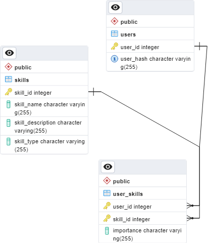

# Back-end for Skill Collector

This is the back-end for a web app called Skil Collector, which was created by a team of six people I was part of.
I was in charge of the back-end and database; all work in this repository is mine entirely.

## Description

Skill Collector is a web application that allows users to pick the SFIA (Skills Framework for the Information Age) skills that are most important to them. The application provides users with a way to log in and pick 20 skills, 5 from each importance category. In addition to this, the user can pick 4 soft skills, one for each importance category.

The users were given user hashes, which were placed into the `users` table in the database. These hashes functioned as usernames for
the platform, and were given to me via a spreadsheet, so this back-end contains no functionality for users to create their own accounts.

## Technologies Used

-    Node.js
-    Express.js
-    PostgreSQL
-    Various npm packages (express-session, pg, cors, body-parser, dotenv)

## Database

This project utilizes a PostgreSQL database to manage user information and their selected SFIA and soft skills. The database consists of three main tables: `users`, `skills`, and `user_skills` (shown here as an ERD):<br>



### Table: `users`
This table stores information about the users of the web application. It has the following columns:

* `user_id` (SERIAL PRIMARY KEY): Unique identifier for each user.
* `user_hash` (VARCHAR(255) UNIQUE NOT NULL): A hash value that uniquely identifies each user, ensuring data integrity and privacy.

### Table: `skills`
The skills table contains information about the available SFIA and soft skills. It includes the following columns:

* `skill_id` (SERIAL PRIMARY KEY): Unique identifier for each skill.
* `skill_code` (VARCHAR(255) NOT NULL): A code representing the skill.
* `skill_name` (VARCHAR(255) NOT NULL): The name of the skill.
* `skill_type` (VARCHAR(255) NOT NULL): Indicates whether the skill is related to SFIA or soft skills.
* `skill_description` (VARCHAR(500) NOT NULL): A brief description of the skill.

### Table: `user_skills`
This table establishes a many-to-many relationship between users and skills, storing the skills selected by each user and their importance level. The table includes the following columns:

* `user_id` (INTEGER NOT NULL): Foreign key referencing the `user_id` column in the users table.
* `skill_id` (INTEGER NOT NULL): Foreign key referencing the `skill_id` column in the skills table.
* `importance_level` (VARCHAR(255) NOT NULL): Indicates the importance level of the skill for the user.
* The combination of `user_id` and `skill_id` forms the primary key, ensuring uniqueness.

This database design allows users of the web app to select SFIA and soft skills important to them and store their preferences efficiently. The users table keeps track of user information, the skills table holds the available skills' details, and the user_skills table establishes the relationships between users and their selected skills.

## Use of routes in the front-end:

### **POST** Login (`http://localhost:5000/auth/login`)

Logs the user into the application by checking the given hash value against the database. Express session cookies are employed for user authorization. This approach offers several advantages that enhance the security and user experience of the application.

Express session cookies enable the server to maintain session state and authenticate user requests. When a user logs in, a unique session identifier is generated and stored as a cookie in the user's browser. This session identifier is sent with subsequent requests, allowing the server to identify and authenticate the user.

_Note: None of the other routes will work without a user being logged in, you'll receive an error code 401 (Unauthorized)_

#### How to use:

-    Send the user's input as JSON POST request with the route `http://localhost:5000/auth/login`:

```json
{
	"hashValue": "b4wy4dIkkth"
}
```

-    When successful, returns status code `200 OK` and some JSON:

```json
{
	"success": true,
	"userId": 1
}
```

-    When unsuccessful, returns status code `401 Unauthorized` as well as some HTML like this:

```html
Invalid credentials
```

### **POST** Logout (`http://localhost:5000/auth/logout`)

This clears the session cookie and logs the user out of the application.

#### How to use:

-    Send a POST request to `http://localhost:5000/auth/logout` - user is automatically detected with the session cookie.

-    When successful, returns status code `200 OK` and some JSON:

```json
{
	"success": true
}
```

### **GET** All Skills (`http://localhost:5000/skills`)

Gets all the skills from the `skills` table in the database.

#### How to use:

-    Send a GET request to `http://localhost:5000/skills` - user is automatically detected with the session cookie.

-    When successful, returns status code `200 OK` and some JSON containing the skills:

```json
[
    {
        "skill_id": 1,
        "skill_code": "BPTS",
        "skill_type": "SFIA",
        "Skill": "Acceptance testing",
        "Description": "Validating systems, products, business processes or services to determine whether the acceptance criteria have been satisfied."
    },
    {
        "skill_id": 2,
        "skill_code": "ADEV",
        "skill_type": "SFIA",
        "Skill": "Animation development",
        "Description": "Designing and developing animated and interactive systems such as games and simulations."
    },
```

... etc.

-    When unsuccessful, returns status code `401 Unauthorized` and some HTML:

```html
Unauthorized
```

### **PUT** User Skills (`http://localhost:5000/userSkills/update`)

Updates the user's selected skills in the `user_skills` table to reflect the updated selections. Skills not present in the request are deleted from the database, and new ones are added.

#### How to use:

-    Send a PUT request to `http://localhost:5000/userSkills/update` containing JSON with all the skills the user has selected:

```json
[
	{
		"Skill": "Benefits management",
		"location": "IMPORTANT FOR THE FUTURE",
		"skill_code": "BENM",
		"skill_id": 7,
		"skill_type": "SFIA"
	},
	{
		"Skill": "Contract management",
		"location": "IMPORTANT",
		"skill_code": "ITCM",
		"skill_id": 22,
		"skill_type": "SFIA"
	},
```

... etc

_Note: Has to contain `location`, and `skill_id`_

-    When successful, returns status code `200 OK`

## Scripts

I also created some Python scripts to aid in the development of the application. These scripts are located in the `scripts` folder:

- [`csv-exporter.py`](./scripts/csv-exporter.py) - This script exports the data from the `user_skills` table in the database to a CSV file. This script is useful for backing up the data in the database and for importing the data into other applications.

- [`csv-importer.py`](./scripts/csv-importer.py) - This script imports the skill data from a CSV file into the `skills` table in the database. This script is useful for adding new skills to the database, if more SFIA skills are added in the future.

## Contributors:

-    Taavi Kalaluka - Back-end Engineer
